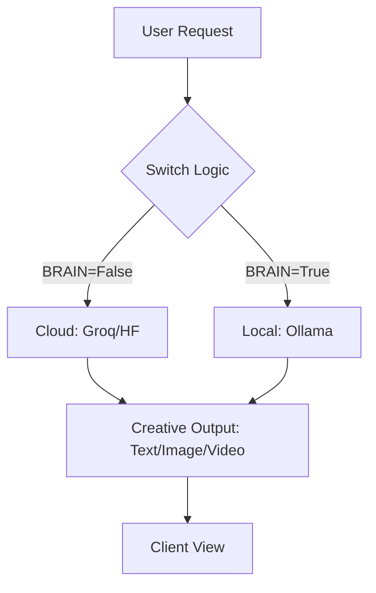

# AdGpt 
### Core Product for ImpactNexus

**AdGpt** is a high-performance, multimodal conversational AI platform designed for seamless automated content generation. It intelligently switches between high-speed Cloud inference and privacy-focused local models to deliver a robust, scalable experience.

##  The Problem
Creating high-quality marketing and creative content (Text, Image, Video) often requires juggling multiple disconnected AI tools, leading to fragmented workflows, high subscription costs, and inconsistent output quality.

##  The Solution
**AdGpt** provides a unified "Next-Gen Creative Suite" that orchestrates:
- **Multimodal Generation**: Native support for Text, Image, and Video.
- **Dynamic Brain Switching**: Auto-toggles between Cloud (Groq) for speed and Local (Ollama) for cost/privacy.
- **Production-Ready API**: A robust FastAPI backend for seamless integration.

##  Tech Stack
- **Backend**: Python, FastAPI, Uvicorn
- **AI Inference (Cloud)**: Groq (Llama 3.1), Hugging Face
- **AI Inference (Local)**: Ollama (Qwen 3.5)
- **Frontend**: HTML5, Vanilla CSS, JS

##  Workflow Diagram


##  Environment Configuration
Create a `.env` file in the root directory using the following template:

```env
# --- API Keys ---
GROQ_API_KEY=your_groq_key_here
HF_API_KEY=your_huggingface_key_here

# --- Model Selection ---
GROQ_MODEL=llama-3.1-8b-instant
OLLAMA_MODEL=qwen3.5:0.8b

# --- Server Config ---
PORT=8000
HOST=127.0.0.1

# --- Logic Switch ---
# BRAIN: True (Local/Ollama) | False (Cloud/Groq)
BRAIN=False
# ALLOW_GROQ_FALLBACK: Enable automatic fallback if local fails
ALLOW_GROQ_FALLBACK=False
```

##  Quick Start
1. **Clone & Setup**:
   ```bash
   git clone [repository-url]
   cd impactnexux
   ```
2. **Install Dependencies**:
   Download and install the necessary libraries using:
   ```bash
   pip install -r requirements.txt
   ```
3. **Configure**: Set up your `.env` file based on the template above.
4. **Launch**:
   ```bash
   python run.py
   ```
